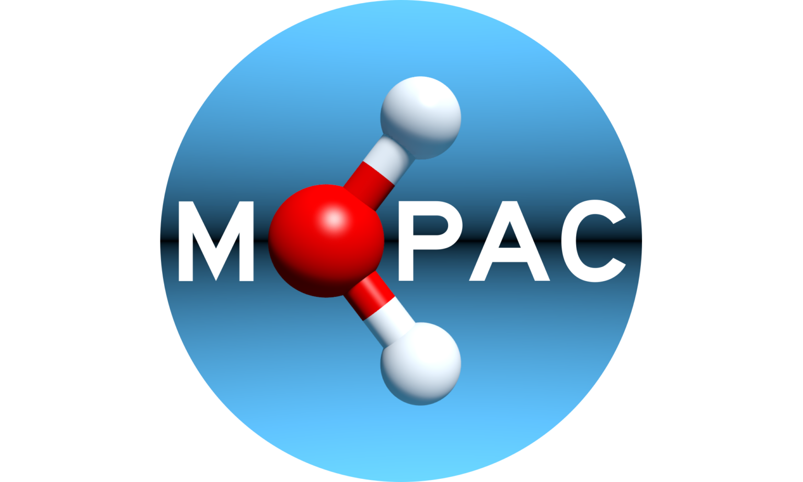
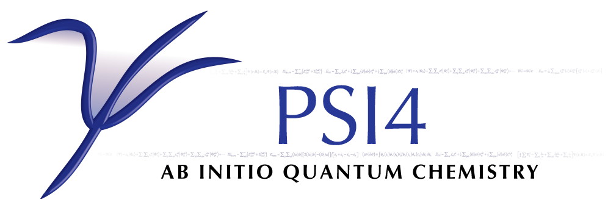

<p align="center">
  
</p>

# Summary


# Example Usage

We suggest first-time users to use the command line interface (CLI) for simulations. The file `cli.py` can be run with your favourite Python environment so long as the appropriate packages can be installed. Then, input files and command line arguments can be supplied to it. Many options are available:

- [MOPAC](#mopac)
- [PSI4](#psi4)
- [ChemPotPy](#chempotpy)
- [ML Potentials](#python-based-ml-potentials)
- [Hybrid Potential](#hybrid-potential)



### MOPAC

To use MOPAC, it must first be installed somehow. On Ubuntu 24.0 for example, it can be installed with:

```
sudo apt install mopac
```

MOPAC is a general semiempirical software which means that it can be used for most reactions of interest. We will try it out on the B + C2H2 reaction. The input files describing the geometry and PES are as follows:

<details>
<summary>B.C2H2.input.xyz</summary>

```text
5

B      0.000000    0.000000    0.000000
C     -1.707100    1.879500    0.000000
C     -0.611600    2.321200    0.000000
H      0.365700    2.747600    0.000000
H     -2.684400    1.453100    0.000000
```
</details>

<details>
<summary>B.C2H2.input.mopac</summary>

```text
           method AM1
           charge 0
     multiplicity 2
          maxiter 1500
```
</details>

Then, any initial sampling and MD parameters can be given to this so long as the B and C2H2 are kept separate. For example, for a bimolecular collision initiated with 2.4 kcal/mol of collision energy and cold C2H2, the following command works:

```
python -u cli.py B.C2H2.input.xyz B.C2H2.input.mopac . --atomsInFirstGroup "1" --collisionEnergy 2.4 --impactParameter 1.0 --centerOfMassDistance 10.0 --production 100 --interval 1 --time_step 0.15 --INITQPa "thermal" --INITQPb "thermal" --TVIBa 300.0 --TROTa 300.0 --TVIBb 10.0 --TROTb 10.0 --n_threads 1 > production.log
```

Sometimes the SCF calculation in MOPAC does not converge which leads to the error: `ase.calculators.calculator.CalculationFailed: ... failed`. This happens about 1/5 times for this system; restarting it often resolves this.




### PSI4

To use PSI4, it can be installed with conda. You can create a conda environment for it like so:

```
conda create --name psi4md psi4 ase -c conda-forge
conda activate psi4md
```

PSI4 is a general ab initio software which means that it can be used for any adiabatic reaction. Thus, it can be used for the same B + C2H2 reaction. The same geometry file `B.C2H2.input.xyz` can be used, while the PES is altered as:

<details>
<summary>B.C2H2.input.xyz</summary>

```text
5

B      0.000000    0.000000    0.000000
C     -1.707100    1.879500    0.000000
C     -0.611600    2.321200    0.000000
H      0.365700    2.747600    0.000000
H     -2.684400    1.453100    0.000000
```
</details>

<details>
<summary>B.C2H2.input.psi4</summary>

```text
referencemethod uhf
     psi4method b3lyp/def2-sv(p)
         charge 0
   multiplicity 2
```
</details>

Similar to the MOPAC implementation, any initial sampling and MD parameters can be given to this so long as the B and C2H2 are kept separate. For example, for a bimolecular collision initiated with 2.4 kcal/mol of collision energy and cold C2H2, the following command works:

```
python -u cli.py B.C2H2.input.xyz B.C2H2.input.psi4 . --atomsInFirstGroup "1" --collisionEnergy 2.4 --impactParameter 1.0 --centerOfMassDistance 10.0 --production 100 --interval 1 --time_step 0.15 --INITQPa "thermal" --INITQPb "thermal" --TVIBa 300.0 --TROTa 300.0 --TVIBb 10.0 --TROTb 10.0 --n_threads 1 > production.log
```

While PSI4 is parallelized, it is a full electronic structure calculation so it takes more than a minute to do the molecular dynamics, let alone the initial sampling. By default, if there are convergence issues at any step of the initial sampling or dynamics, the ab initio calculation is restarted with slightly different or looser parameters. We suggest skipping a full trajectory simulation if trying this as a test.


### ChemPotPy

To use ChemPotPy, the main package can be installed with `pip` and some helper packages must be installed with `conda`. As suggested by the developers, a new conda environment can be made for chempotpy with the appropriate packages installed like so:

```
conda create --name chempotpy
conda activate chempotpy
conda install python=3.11
conda install mkl mkl-service
conda install -c conda-forge gfortran
pip install numpy "numpy>=1.26,<1.27"
pip install charset_normalizer
pip install ase
pip install chempotpy
```

ChemPotPy is a collection of analytical potentials, originally made in Fortran and then packaged with a Python wrapper. Thus, only specific chemical reactions can be studied. We will try it out on the O + O2 reaction; find the full list of reactions available at: https://github.com/shuyinan/chempotpy.  The input files describing the geometry and PES are as follows:

<details>
<summary>O.O2.input.xyz</summary>

```text
3

O    0.00000000   0.00000000  100.00000000
O    0.00000000   0.00000000    0.59301532
O    0.00000000   0.00000000   -0.59301532
```
</details>

<details>
<summary>O.O2.input.chempotpy</summary>

```text
Q1-Sgm    chempotpy O3 O3_6_5Ap_2023 0
```
</details>

Then, any initial sampling and MD parameters can be given to this. For example, for a bimolecular collision initiated with 2.4 kcal/mol of collision energy and cold O2, the following command works:

```
python -u cli.py O.O2.input.xyz O.O2.input.chempotpy . --atomsInFirstGroup "1" --collisionEnergy 2.4 --impactParameter 1.0 --centerOfMassDistance 10.0 --production 100 --interval 1 --time_step 0.15 --INITQPa "thermal" --INITQPb "thermal" --TVIBa 300.0 --TROTa 300.0 --TVIBb 10.0 --TROTb 10.0 --n_threads 1 > production.log
```

<p>


</p>

### Python-Based ML Potentials


### Hybrid Potential


